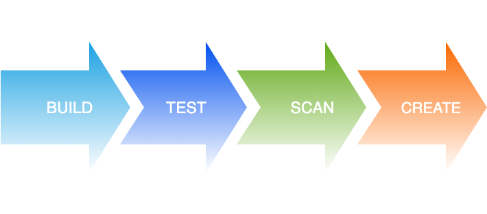
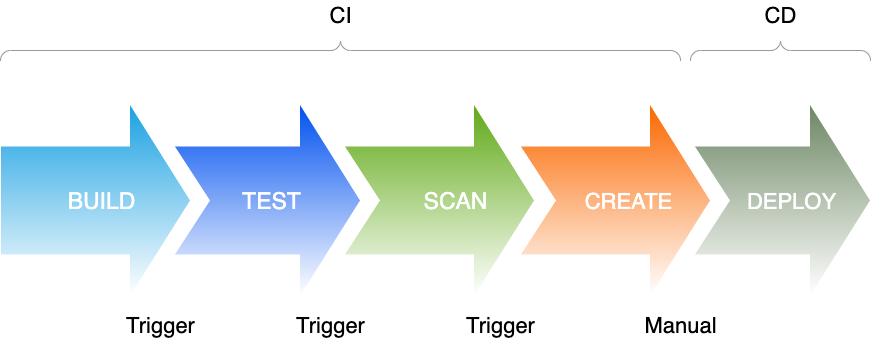

# Service standards

Service standards can encompass a lot of specific areas, but for now we will concentrate
on the following:
1. Continuous Integration [here](#continuous-integration)
2. Continuous Deployment [here](#continuous-deployment)
3. Naming conventions
4. Source control templates 
5. Default REST endpoints

# Continuous Integration

Continuous integration (CI) is the practice of automating the integration
of code changes from multiple contributors into a single software project.
It's a primary DevOps best practice, allowing developers to frequently 
merge code changes into a central repository where builds and tests then 
run. ([ref](https://www.atlassian.com/continuous-delivery/continuous-integration#:~:text=Continuous%20integration%20(CI)%20is%20the,builds%20and%20tests%20then%20run.))

But way do we need CI?

1. It is an automated and repeatable framework for building artifacts 
2. It supports versioning and thus auditing, so auditor can see what was built and when
3. If something goes wrong with a stage you can see the code changes that have
made the process fail
4. The framework will run tests to check the code, we KNOW that the code is good as tests have passed

The CI process can have as many steps as you need, but generally there are 4
main steps, Build, Test, Scan, Create in that order and you will need a source code versioing
platform like github or bitbucket

Each step is run in turn and if the step succeeds the next us run, until the pipeline
is completed. Errors stop the process and stakeholders are alerted to this fact and
can investigate as to why the error occurred.

There are several CI platforms that can be used, in no specific order:
- Azure devops
- Github Actions
- Teamcity
- Jenkins

### The Build stage

The build process should run via a standard script called `build.sh` and a non-zero exit code
will mean a failed build. See TBD for the standard file structure for a service.

The build stage is fired via the check-in of code (via either a poll on the code
repository or a webhook). In either event the `build.sh` script will be run.

This stage may actually not do an awful lot for service written in node, as these are compiled 
at runtime, however for netcore the code needs to be compiled (built) before being run specifically

### The Test stage

The test process should run via a standard script called `test.sh` and a non-zero exit code
will mean a failed test stage. See TBD for the standard file structure for a service.

The test stage is automatically fired by a successful build stage

This stage will effectively run any tests, be it unit, outside-in, functional or regression tests

### The Scan stage

This stage is important for the security of the code you write and the images or artefacts you produce
and there are plenty of tools out in the wild to test and check your code.
Again its good to have a common entry point so this stage should be run by a `scan.sh` script

This stage is required to make sure your code and service are secure from vulnerabilities
in libraries you use, to analysing your code against [OWASP](https://owasp.org/www-project-top-ten/) standards. 

Here is a list of the tools, again in no specific order, you can look at to secure your code

- **Snyk** is a developer-friendly security platform for anyone responsible for securing code. This includes developers, DevOps, Security, DevSecOps, Compliance, AppSec, and any other team that asks the question, “Is this software safe to put out in the world?”
- **Checkmarx** is an enterprise-grade flexible and accurate static analysis solution used to identify hundreds of security vulnerabilities in custom code.
- **SonarQube** is a Code Quality Assurance tool that collects and analyzes source code, and provides reports for the code quality of your project. It combines static and dynamic analysis tools and enables quality to be measured continually over time
- **Github Dependabot** checks for outdated dependencies as soon as it's enabled. You may see new pull requests for version updates within minutes of adding the configuration file, depending on the number of manifest files for which you configure updates
- **OWASP** Zap is an open-source web application security scanner
- **Anchore** is an open-source tool for scanning and analyzing container images for security vulnerabilities and policy issues

### The Create stage

The create stage in the SDLC creates the actual artifacts that can be deployed. An 
artifact can be literally anything, but usually it is a docker image that can be 
installed onto a docker [daeman](https://dockerlabs.collabnix.com/beginners/components/daemon/#:~:text=The%20Docker%20daemon%20is%20a,on%20MacOS%20and%20Windows%20too.) or a docker orchestrator (like kubernetes)

Generally these artifacts will be deployed to a package manager repository, of which there are many flavours

1. Github packages [here](https://github.com/features/packages)
2. AWS ECR [here](https://aws.amazon.com/ecr/)
3. Dockerhub [here](https://hub.docker.com/)
4. Azure artifacts [here](https://azure.microsoft.com/en-us/services/devops/artifacts/)

All these repositories do a similar role, but fundamentally they can store many kinds of artifect and stamp each with
a version. This allows a user to see a historical record of each build and what source
code it was generated from

# Continuous deployment

Continuous Deployment (CD) is a software release process that uses 
automated testing to validate if changes to a codebase are correct 
and stable for immediate autonomous deployment to a production environment. ([ref](https://www.atlassian.com/continuous-delivery/continuous-deployment))

Not many people use true CD, ie having a fully automated release process but it should be 
something that companies look to reach. Many would have a manual release button
which allows a quasi CD process, ie a choice of the artifact is made and a schdeuled
release is created.

A lot of the services named in the CI section can do CD, eg teamcity, as you can 
create a step in a pipeline that is manually triggered, allowing the user to select which
artifact to deploy.

TRUE CD would be deploying through your environments all the way to production, basing
your confidence on the tests you have written