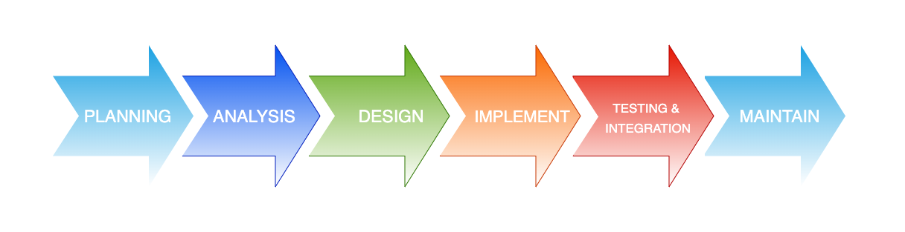

# Governance

#Quick links
Service standards [here](./standards/services.md)

Standards exist for a reason, we at Talent have been writing, testing and deploying code 
and creating infrastructure to some of the highest standards. These standards exist to allow
us to demonstrate to the clients we have produced stable, secure and scalable systems.

Due to our large amount of government clients we adhere to the [GDS](https://www.gov.uk/government/organisations/government-digital-service) which forms 
a framework for how we develop, for example open source, accessibility, security etc

# The SDLC
The Software Development Lifecycle is not something thats new but it allows us to break down
each individual phase of the development process.

1. **Planning** - A detailed analysis of the problem and the defined requirements. 
   - Is this part of an overall strategy?
   - What risks are associated with this work?
   - What tools and personnel will we need?
2. **Analysis** - This is where we can start to detail specific requirements in an SRS 
SRS (Software Requirement Specification). This stage would define both the functional and non-functional requirement
The customer will sign off these requirements when happy
3. **Design** - THe process of coming up with a solution against the requirement starts now, hosting
would be looked at and the SaaS/PaaS components available to meet the requirement. Maybe we have
n services with a database and messaging platform.
4. **Implementation** - The building of the solution. We work in an agile way, making sure we fail fast
and learn from mistakes. We don't apply a blanket framework for agile, as the team works best
when they determine the agile process which works for them and the client. We have small stories that together 
meet the requirement, making sure that we try/test/fail fast
5. **Testing** - The system as a whole is tested as part of a UAT / MVP. Does the system meet all the 
requirement
6. **Maintenance** - The system is now in a production environment and is monitored and
alerted on via systems defined in the Design stage.

# Considerations

- **Make sure you agree some principals up front**, there will be points you disagree on so 
make sure these are documented and understood up front
- **Things can be iterative**, there are a number of SDLC models that you can choose to apply
but this does not stop you from looping back into the previous stage to re-apply learnings
from the current
- **Agree common terms and language**. You will be bringing multiple disciplines and teams together
A `customer` maybe completely different for different disciplines
- **Check in regularly**, this is important, it doesn't need to be something that takes
hours, a quick simple stand-up to air problems and issues means everyone is communicating
and sharing knowledge
- **Call things out** No one will hold you accountable if you indicate problems sooner, as these can be fixed 
and fed back quicker and limits how far we go down the potential rabbit hole.
- **Make sure everyone knows their role**, this is very important and is part of great 
leadership. If a developer knows WHY they are building something they will be more engaged 
with the project

